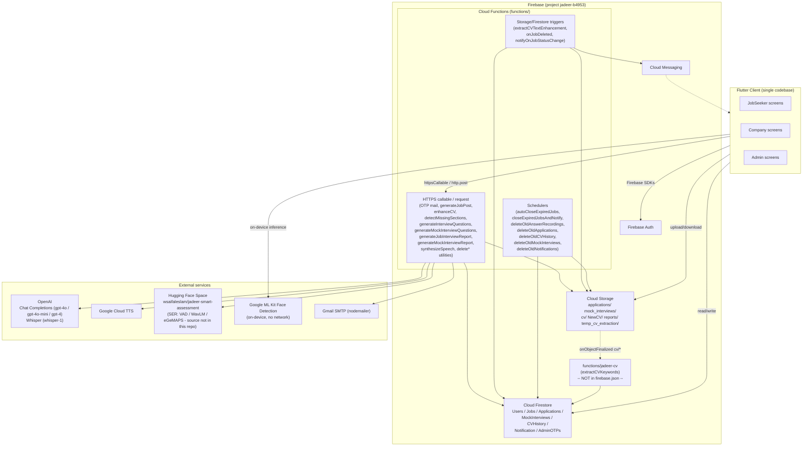
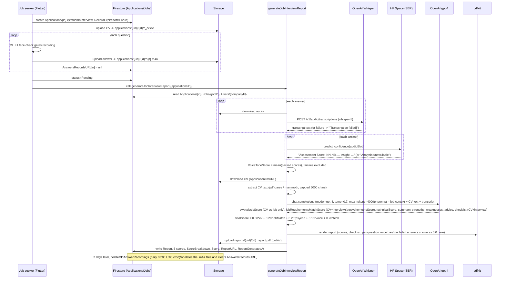

# Jadeer — System Architecture (extracted from source code)

**Method note:** Every table, number, and code path below was read directly out of this repository (`functions/`, `lib/screens/`, `firebase.json`) on 2026-09-26. Nothing here is estimated. Where the code cannot answer a question (e.g. the internals of the external Hugging Face Space), that is stated explicitly instead of guessed. Raw structured data backing every table is in `research/system_architecture/data/*.json`. A separate discrepancy list is in `Discrepancies_and_Issues.md`.

---

## A. Whole-system overview

### A.1 Components

| Layer | Component | What it is |
|---|---|---|
| Client | Flutter app (`lib/screens/*.dart`) | Single codebase, role-branched by `Users.UserType` (`JobSeeker`, `Company`, `Admin`) at login. No separate app targets — job seeker, company, and admin UIs are just different screens reached after login. |
| Auth | Firebase Authentication | Email/password for all three roles. OTP (email, 6-digit, 2-minute validity) is layered on top for Admin login, JobSeeker/Company signup, and password reset — implemented in application code, not Firebase Auth's native MFA. |
| Data | Cloud Firestore | Collections: `Users`, `Jobs`, `Applications`, `MockInterviews`, `CVHistory`, `Notification`, `AdminOTPs` (see §A.3). |
| Storage | Firebase Storage | Folders: `applications/{uid}/{appId}/`, `mock_interviews/{uid}/{mockId}/`, `cv/{uid}/`, `temp_cv_extraction/{uid}/`, `NewCV/{uid}/`, `reports/{uid}/`, `photos/{uid}/`, `logos/{uid}/`. |
| Compute | Firebase Cloud Functions (Node 20, `functions/index.js` + `functions/interview/`, `functions/mockinterview/`, `functions/notification/`) | 28 functions — HTTPS callable, HTTPS request, Storage-triggered, Firestore-triggered, and scheduled. Full inventory in §A.2. |
| Compute (separate, unclear deploy status) | `functions/jadeer-cv/` (TypeScript) | One function, `extractCVKeywords`. This directory is **not** referenced by `firebase.json` (`functions.source` points only at `functions`), so whether it is actually deployed to the live project cannot be confirmed from this repository. |
| External AI/ML | OpenAI (Chat Completions + Whisper), Google Cloud Text-to-Speech, an externally-hosted Hugging Face Space (`wsaifaleslam/jadeer-smart-assessment`) for voice-tone/SER analysis, Google ML Kit Face Detection (on-device) | See §C and §D. |
| Notifications | Firebase Cloud Messaging + in-app `Notification` collection | Triggered by Firestore writes (`Jobs` status changes) and by the two "close expired jobs" schedulers. |

### A.2 Cloud Functions inventory

Full detail (trigger config, exact reads/writes, external calls) is in `data/cloud_functions.json`. Summary:

| # | Function | Trigger | Calls out to |
|---|---|---|---|
| 1 | `sendAdminOtp` | HTTPS callable | Gmail SMTP |
| 2 | `sendSignupOtp` | HTTPS callable | Gmail SMTP |
| 3 | `sendCompanyDocumentRequest` | HTTPS callable | Gmail SMTP |
| 4 | `notifyCompanyStatusChange` | HTTPS callable | Gmail SMTP |
| 5 | `generateJobPost` | HTTPS request | OpenAI (gpt-4o-mini) |
| 6 | `enhanceCV` | HTTPS callable | OpenAI (gpt-4o) |
| 7 | `detectMissingSections` | HTTPS callable | OpenAI (gpt-4o-mini ×2) |
| 8 | `sendPasswordResetOtp` | HTTPS callable | Gmail SMTP |
| 9 | `resetUserPassword` | HTTPS callable | Firebase Auth Admin SDK |
| 10 | `deleteUserAccount` | HTTPS callable | Firestore + Storage + Auth (cascade delete) |
| 11 | `extractCVTextEnhancement` | Storage `onObjectFinalized` (`temp_cv_extraction/`) | pdf-parse / mammoth (local) |
| 12 | `generateCVPDF` | HTTPS callable | pdfkit (local) |
| 13 | `autoCloseExpiredJobs` | Scheduled (`0 0 * * *`, Asia/Riyadh) | — |
| 14 | `generateInterviewQuestions` | HTTPS request | OpenAI (gpt-4o-mini) |
| 15 | `generateMockInterviewQuestions` | HTTPS request | OpenAI (gpt-4o-mini) |
| 16 | `generateMockInterviewReport` | HTTPS callable | Whisper, HF Space (SER), OpenAI (gpt-4) |
| 17 | `generateJobInterviewReport` | HTTPS callable | Whisper, HF Space (SER), OpenAI (gpt-4) |
| 18 | `deleteOldCVHistory` | Scheduled (`0 0 * * *`, UTC) | — |
| 19 | `onJobDeleted` | Firestore `onDocumentDeleted` (`Jobs/{jobId}`) | — |
| 20 | `deleteCVHistory` | HTTPS callable | — |
| 21 | `deleteOldMockInterviews` | Scheduled | — |
| 22 | `deleteMockInterview` | HTTPS callable | — |
| 23 | `deleteOldAnswerRecordings` | Scheduled (`0 3 * * *`, UTC) | — |
| 24 | `deleteOldApplications` | Scheduled (`0 0 * * *`, UTC) | — |
| 25 | `synthesizeSpeech` | HTTPS request | Google Cloud TTS |
| 26 | `notifyOnJobStatusChange` | Firestore `onDocumentUpdated` (`Jobs/{jobId}`) | Firebase Cloud Messaging |
| 27 | `deleteOldNotifications` | Scheduled (every 24h) | — |
| 28 | `closeExpiredJobsAndNotify` | Scheduled (every 1 minute) | Firebase Cloud Messaging |
| — | `extractCVKeywords` (separate codebase, deploy status unconfirmed) | Storage `onObjectFinalized` (`cv/`) | none (local keyword frequency algorithm) |

**What this shows:** Jadeer's backend is a single Cloud Functions app plus one orphaned/uncertain second codebase. It leans on three schedulers that all touch `Jobs` status (`autoCloseExpiredJobs`, `closeExpiredJobsAndNotify`, and indirectly `notifyOnJobStatusChange`), and on a separate daily scheduler (`deleteOldAnswerRecordings`) as the only mechanism that removes interview audio. There is no dedicated "matching" or "recommendation" backend function — that logic lives entirely on the client (§C, §D).

### A.3 Firestore collections

| Collection | Purpose | Key fields |
|---|---|---|
| `Users` | All accounts (JobSeeker/Company/Admin) | `UserType`, `AccountStatus`, `CVKeywords[]`, `favorite[]`, `AiUsage.{CvEnhancement,MockInterview,LastReset}`, `failedLoginAttempts`, `accountLocked` |
| `Jobs` | Company job postings | `UserID`, `Questions[]` (with `type`/`category`/`trait`), `Requirements[]`, `JobStatus` |
| `Applications` | One per job application + its interview + its report | `AnswersRecordsURL[]`, `Score`, `ScoreBreakdown{}`, `Report{}`, `ReportURL` |
| `MockInterviews` | One per practice session | `AnswersRecordsURL[]`, `Report{}`, `VoiceConfidenceScore` |
| `CVHistory` | One per CV-enhancement run | `OldCVText`, `NewCVText[]`, `Suggestions[]`, `NewCVURL` |
| `Notification` | In-app notifications | `UserID`, `JobID`, `Message`, `Read` |
| `AdminOTPs` | Transient OTP storage, doc id = email | `OTP`, `ExpiresAt`, `Used` |

Full field lists: `data/firestore_collections.json`.

**What this shows:** `Applications` and `MockInterviews` are structurally parallel (both hold `AnswersRecordsURL[]` and a `Report`), but only `Applications` carries a PDF (`ReportURL`) and a 5-part `ScoreBreakdown`; `MockInterviews` has neither. `deleteUserAccount` also references `CVEnhancement`, `Interview(s)`, `ReportGenerator`, `Reports`, `WebSchedule(s)`, `Favorites`, `Favourite`/`Favorite`, and `AIServiceRequests` as delete targets, but no code in this repo was found that *writes* to those collections — see Discrepancies list.

### A.4 Main flows (high level)

- **Registration & company verification:** Signup writes `Users` with `AccountStatus='Pending'` (Company) or verifies email via OTP (JobSeeker/Company both use signup-OTP). For companies, an admin manually emails a document request (`sendCompanyDocumentRequest`), reviews the employment letter out of band, and clicks Verified/Rejected in `admin_dashboard.dart`, which writes `Users.AccountStatus` directly from the client and then calls `notifyCompanyStatusChange` to email the result. Rejected accounts get `ExpiryDate = now+7d`; the actual deletion of expired-rejected accounts runs as a client-side sweep inside the admin dashboard's own load path, not a server-side scheduler.
- **Job posting (AI description + questions):** Company fills a form → `generateJobPost` (gpt-4o-mini) drafts the description text → company edits/confirms → on save, the client separately calls `generateInterviewQuestions` (gpt-4o-mini) to generate the 10 interview questions (5 technical + 5 psychometric) stored on `Jobs.Questions`. `Jobs.JobKeywords` are extracted **client-side** by a hardcoded stop-word/regex function in `job_posting.dart`, not by AI.
- **Job browsing / "For You":** The home feed pulls the most recent `Jobs`, then — only if the signed-in job seeker has a CV uploaded and `Users.CVKeywords` populated — ranks jobs by a **client-side keyword-overlap score** (`_cvMatchScore` in `jobseeker_home.dart`): +2 per CV keyword found in the job's title/position/specialty/keywords bag, +1 bonus if that keyword also appears in the specialty string; jobs scoring ≥2 float to the top. This is not an ML/embedding recommender.
- **CV enhancement:** See pipeline in §B.3.
- **Mock interview:** See pipeline in §B.2.
- **Job application + interview + report:** See pipeline in §B.1.

### A.5 Security & privacy mechanisms found in code

| Mechanism | Where enforced | Notes |
|---|---|---|
| Firebase Auth (email/password) | Client SDK | Standard. |
| Email OTP (2-min validity) | `sendAdminOtp`/`sendSignupOtp`/`sendPasswordResetOtp` functions + `AdminOTPs` collection | OTP is generated **client-side** (`Random().nextInt`) and only relayed by the function; the function does not itself validate it. |
| Login lockout (5 attempts/day) | **Entirely client-side**, `lib/screens/login.dart` | Reads/writes `Users.failedLoginAttempts`/`accountLocked` directly via the Firestore SDK. No Cloud Function or Firestore rule was found enforcing this — see Discrepancies. |
| API key handling | Firebase Functions v2 `secrets` (`OPENAI_API_KEY`, `HF_TOKEN`, `GOOGLE_TTS_API_KEY`) for v2 functions | However `EMAIL_USER`, `ADMIN_EMAIL`, and `EMAIL_APP_PASSWORD` (a Gmail app password) are **hardcoded plaintext literals** at the top of `functions/index.js` — see Discrepancies. |
| Firestore/Storage security rules | **Not present in this repository** | No `firestore.rules`/`storage.rules` file exists, and `firebase.json` declares no `firestore`/`storage` config block at all. Access control (if any) is configured directly in the Firebase console and cannot be audited from this codebase. |
| On-device face/liveness check | `google_mlkit_face_detection`, client-side, both interview screens | Gates the Record/Next buttons only; never uploads a frame or a detection result. See §D and `data/llm_calls.json`. |
| Audio deletion | `deleteOldAnswerRecordings` scheduled function | Deletes `.m4a` files 2 days after `ReportGeneratedAt` (not immediately after processing); also deleted immediately on interview cancellation, job deletion, or account deletion. |
| Record expiry field | `Applications.RecordExpiresAt = now+120d` | Written at interview start but never read by any function found in this repo — dead field (actual retention is the 2-day rule above). |

---

## B. Detailed pipelines

### B.1 Job interview → evaluation report

```
1. lib/screens/job_interview_service.dart (JobInterviewService.start / _createAndStart)
   - Checks for an existing Application for (uid, jobId); blocks duplicate applications.
   - Loads Jobs.Questions; requires a non-empty CV/profile (photo, CV, DoB, nationality, contact).
   - Uploads the applicant's CV to Storage: applications/{uid}/{appId}/{ts}_cv.{ext}
   - Creates Applications/{appId}: ApplicationCVURL/Path, ApplicationStatus='InInterview',
     Answers[]/AnswersRecordsURL[] pre-sized to question count, RecordExpiresAt=now+120d.

2. JobInterviewSessionScreen (same file)
   - Per question: on-device ML Kit face check gates recording; records with `record` package
     (AAC-LC, 128kbps, 44.1kHz mono) to a temp .m4a file.
   - Uploads each answer to Storage: applications/{uid}/{appId}/q{n}.m4a
   - Writes AnswersRecordsURL[n] to Applications/{appId} after each answer.
   - Text-to-speech playback of each question via the synthesizeSpeech function (Google TTS).
   - On last answer: sets ApplicationStatus='Pending', then calls the
     generateJobInterviewReport callable (30-minute client timeout) and navigates away
     without waiting for/handling its result on the client (fire-and-forget try/catch).

3. functions/interview/generateJobInterviewReport.js (generateJobInterviewReport)
   a. Reads Applications/{id} (AnswersRecordsURL, JobID, ApplicationCVURL, UserID) and
      Jobs/{jobID} (Questions, Specialty, Requirements, Description); looks up the
      company name from Users/{Jobs.UserID} if not already on the Application.
   b. Transcribes every non-empty answer with OpenAI Whisper (model "whisper-1", raw REST
      call to /v1/audio/transcriptions). Per-answer failures are caught and recorded as
      "[Transcription failed]"; those are excluded from the text sent to GPT.
   c. Voice tone analysis: polls the HF Space's status endpoint (up to 10 tries, 4s apart)
      to wake it if asleep, connects via @gradio/client, and calls
      predict("predict_confidence", [audioBlob]) once per answer. A failure for any
      answer is recorded as "Analysis unavailable" for that answer.
   d. Computes VoiceToneScore = round(mean of all successfully-parsed
      "Assessment Score: NN.N%" values); answers with no parsable score are excluded
      from this mean (not treated as 0). If none parse, VoiceToneScore = 0.
   d2. Downloads the applicant's CV from ApplicationCVURL and extracts its text
      in-memory (pdf-parse for PDF, mammoth for DOCX; capped at 6000 characters).
      Falls back to an empty CV block (with a logged warning) if extraction fails.
   e. Builds a job-context string (title/specialty/company/requirements/description
      excerpt ≤500 chars) + a CV-text block + the transcript text, and sends ONE
      prompt to OpenAI Chat Completions (model "gpt-4", temperature 0.7,
      max_tokens 4000) asking for cvAnalysisScore, jobRequirementsMatchScore,
      psychometricScore, technicalScore, overallSummary, strengths, weaknesses,
      advice, requirementsChecklist, psychometricAnalysis, questionsAndAnswers,
      all in third person.
      -> cvAnalysisScore is instructed to score CV-vs-job-posting alignment ONLY
         (no interview evidence); jobRequirementsMatchScore and
         requirementsChecklist are both instructed to use CV + interview
         answers together, and to agree with each other (fixed 2026-09-26; see §D.1).
   f. finalScore = round(cv*0.30 + jobMatch*0.20 + psycho*0.20 + voice*0.10 + tech*0.20).
   g. Renders a PDF (pdfkit) with the score breakdown, requirements checklist,
      psychometric analysis, per-question voice-tone bars, and full Q&A transcript;
      uploads it to Storage reports/{uid}/{appId}_report.pdf and makes it public.
   h. Writes all scores, the raw Report object, VoiceToneAnalysis, RequirementsChecklist,
      PsychometricAnalysis, ReportURL, and ReportGeneratedAt back onto Applications/{id}.

4. functions/index.js (deleteOldAnswerRecordings, scheduled daily 03:00 UTC)
   - 2 days after ReportGeneratedAt, deletes the .m4a files under
     applications/{uid}/{appId}/ and clears AnswersRecordsURL[] on the Application doc
     (the document, Report, and PDF are kept).
```

### B.2 Mock interview → feedback report

Shares with the job-interview pipeline: the same Whisper transcription step, the same HF Space voice-tone call pattern (including identical "Analysis unavailable" fallback and score-averaging code, duplicated almost verbatim in `functions/mockinterview/generateReport.js`), the same on-device face-detection gating and TTS question playback on the client, and the same 2-day audio-retention scheduler.

Differs:

| Aspect | Job interview (`generateJobInterviewReport.js`) | Mock interview (`generateReport.js`) |
|---|---|---|
| Question source | `Jobs.Questions` (company-specific, generated once at job-posting time) | Freshly generated per session by `generateMockInterviewQuestions` (specialty-only, not tied to a job) |
| GPT model / prompt person | `gpt-4`, temp 0.7, max_tokens 4000, strictly **third person** ("the candidate") for a hiring manager | `gpt-4`, temp 0.7, max_tokens 2000, strictly **second person** ("you") as a coach |
| Acoustic data reaching GPT | Not included in the prompt at all | `overallVoiceConfidenceScore` (the averaged SER score) **is** injected as text into the prompt, and GPT is asked to write a `mockVoiceComment` about pacing/hesitation from it |
| Final score | Explicit weighted formula in code (30/20/20/10/20) | `overallScore` is produced directly by GPT-4 as one JSON field — **no weighted-sum formula in code** |
| Output artifact | PDF report uploaded to Storage + `ReportURL` | **No PDF at all** — the report is only the Firestore `Report{}` object, rendered in-app |
| Requirements checklist | Yes, against `Jobs.Requirements` | N/A (no job) |
| Credits | Unlimited (one interview per application) | Capped at 2/day via `Users.AiUsage.MockInterview`, reset daily, refunded on failure to start |

### B.3 CV enhancement: upload → text extraction → missing sections → skills suggestion → enhancement → PDF

```
1. cv_enhancement.dart: creates CVHistory/{id} (empty fields), uploads the file to
   Storage temp_cv_extraction/{uid}/{ts}_{filename} with customMetadata
   {cvHistoryId, userId}, then listens on the CVHistory doc for OldCVText to appear.

2. extractCVTextEnhancement (Storage onObjectFinalized, path temp_cv_extraction/):
   - PDF -> pdf-parse; DOC/DOCX -> mammoth. Writes CVHistory.OldCVText, deletes the
     temp file from Storage and from local tmp.

3. Client shows a job-selection step (existing Jadeer job / free-text job / none),
   writes CVHistory.JobTitle/Description, then calls detectMissingSections:
   - Sub-call 1 (gpt-4o-mini, temp 0.3, max_tokens 500, json_object): flags which of
     PersonalInformation/Summary/Experience/Education/Skills/Certifications/Languages
     are missing or empty in OldCVText.
   - Sub-call 2 (gpt-4o-mini, temp 0.5, max_tokens 800, json_object), only if a target
     job was given: suggests 15-20 relevant skills for that job/description.

4. enhanceCV (gpt-4o, temp 0.7, max_tokens 4000, json_object):
   - Prompt explicitly forbids inventing content; rewrites/reorders/tailors up to
     24 possible CV sections against the target job if one was given.
   - Writes CVHistory.NewCVText[]/Suggestions[], then immediately renders a PDF via
     pdfkit and uploads it to Storage NewCV/{uid}/{cvHistoryId}.pdf
     (CVHistory.NewCVURL), all inside the same function invocation.
```

**What this shows:** CV enhancement is capped at 2 runs/day per user (`Users.AiUsage.CvEnhancement`), reset by a client-side date check, not a server cron. `detectMissingSections` and `enhanceCV` are separate callable functions invoked sequentially by the client — there is no single "enhance" endpoint.

---

## C. Every LLM call (models, params, prompt inputs)

| Call site | Model | Temp | Max tokens | `response_format` | Prompt input |
|---|---|---|---|---|---|
| `generateJobPost` | `gpt-4o-mini` | 0.7 | 2000 | none (free text) | title, position, speciality |
| `enhanceCV` | `gpt-4o` | 0.7 | 4000 | `json_object` | OldCVText, JobTitle, Description, optional user-supplied extra sections |
| `detectMissingSections` (sections) | `gpt-4o-mini` | 0.3 | 500 | `json_object` | OldCVText |
| `detectMissingSections` (skills) | `gpt-4o-mini` | 0.5 | 800 | `json_object` | JobTitle, Description (only if job set) |
| `generateInterviewQuestions` | `gpt-4o-mini` | 0.7 | not set (provider default) | none (manually JSON-extracted) | job title/position/specialty/requirements/description(≤2000 chars)/mix/difficulty |
| `generateMockInterviewQuestions` | `gpt-4o-mini` | 0.7 | not set (provider default) | none (manually JSON-extracted) | normalized specialty bucket, fixed 3/5/2 easy/med/hard split |
| `generateJobInterviewReport` | `gpt-4` | 0.7 | 4000 | none (prompt-instructed JSON) | job context (title/specialty/company/requirements/description≤500 chars) + **extracted CV text (≤6000 chars, added 2026-09-26)** + interview transcript + requirements list |
| `generateMockInterviewReport` | `gpt-4` | 0.7 | 2000 | none (prompt-instructed JSON) | specialty + interview transcript + the averaged acoustic voice-confidence score as text |

Non-LLM AI/ML calls: OpenAI Whisper (`whisper-1`, raw transcription endpoint), the external Hugging Face Space for voice-tone/SER scoring, Google Cloud TTS (`en-US-Neural2-D`), on-device ML Kit face detection, and two purely local deterministic algorithms (CV keyword extraction by frequency, and the "For You" keyword-overlap job ranking). Full parameters: `data/llm_calls.json`.

**What this shows:** Every generation/classification task in Jadeer uses OpenAI's Chat Completions API — there is no in-house fine-tuned LLM. Question-generation and CV-support tasks use the cheaper `gpt-4o-mini`; CV rewriting uses `gpt-4o`; both interview-report tasks use the older `gpt-4` (not `gpt-4o`), and neither report call sets `response_format: json_object` — both rely on prompt instructions plus manual ```-fence stripping before `JSON.parse`, which is a real (if usually reliable) parsing risk that `json_object` mode would have removed.

---

## D. Specific checks requested

### D.1 Does the job-interview report prompt ever receive the candidate's CV text?

**As of the fix applied 2026-09-26, yes.** Originally, `generateJobInterviewReport.js` never read the uploaded application CV's content — it only carried `ApplicationCVURL` through to the PDF as a clickable reference link, while `cvAnalysisScore` (weighted 30% of the final score) was scored purely from the interview transcript, despite its name. This has been corrected: the function now downloads the CV from `ApplicationCVURL`, extracts its text in-memory (`pdf-parse`/`mammoth`, capped at 6000 characters), and includes it in the GPT-4 prompt as a `Candidate's CV (extracted text)` block. Three fields now use it, deliberately with different evidence scopes:
- `cvAnalysisScore` (30% weight) — CV content vs. the job's requirements/description **only**; the interview transcript is explicitly excluded from this score by instruction.
- `jobRequirementsMatchScore` (20% weight) and `requirementsChecklist` (unweighted, PDF display) — both now use CV **and** interview answers together, and are explicitly instructed to agree with each other, since they answer the same underlying question ("does the candidate meet requirement X?") for the same requirements list.

If CV extraction fails for a given application, the function falls back to answers-only scoring for `cvAnalysisScore` and logs a warning — it does not hard-fail the report. See `Discrepancies_and_Issues.md` item 1 for the full before/after history, and note this fix is forward-looking only: it affects reports generated after the change, not any generated before it.

### D.2 What happens when the SER call fails? Does the question score 0 or get excluded?

**Both, depending on where you look — this was reviewed by the team and intentionally left as-is (not a bug, low priority):**
- The **aggregate `VoiceToneScore`** (the number actually used in the 10%-weighted final score) is computed as the mean of only the answers whose SER result string matched `Assessment Score: NN.N%`; a failed answer ("Analysis unavailable") is **excluded** from that mean, not counted as 0. This is the intended behavior. If every answer fails, the aggregate becomes 0 only because there is nothing to average (`validCount>0 ? avg : 0`).
- The **per-question breakdown drawn into the PDF report** (job-interview pipeline only) computes `score = scoreMatch ? ... : "0.0"` for each question individually — so a specific failed answer is **displayed as 0.0/100** with a correspondingly empty progress bar in the report the company reads, even though that same answer was excluded from the score that was actually weighted into the candidate's final grade. The team's position on this (2026-09-26): the exclusion-from-weighting is correct and intentional; the 0.0 display for a failed question is a known cosmetic gap (no distinguishing label) that was consciously not prioritized for a fix at this time.
- Mock interview reports have no PDF, so this display-level detail is specific to the job-interview pipeline.

### D.3 What pause threshold is used (0.6s or 1.0s)? How is the hesitation penalty computed?

**Cannot be verified from this codebase.** The Silero VAD / pause-detection / WavLM+eGeMAPS pipeline described in the brief runs entirely inside the externally-hosted Hugging Face Space `wsaifaleslam/jadeer-smart-assessment`. This repository only contains the client call to that Space (`Client.predict("predict_confidence", [audioBlob])`) and receives back an opaque string (`"Assessment Score: NN.N% ... Insight: ..."`). No VAD parameter, pause-length constant, or hesitation-penalty formula exists anywhere in `functions/`, `lib/`, or any other file here. Reporting a specific number (0.6s or 1.0s) for this would be inventing it. If the paper needs this figure, it has to come from the Space's own source/config, which is not part of this repository.

### D.4 How is the final weighted score computed, and do the weights match 30/20/20/10/20?

From `generateJobInterviewReport.js`:

```js
const finalScore = Math.round(
  cvScore * 0.30 +
  jobMatchScore * 0.20 +
  psychoScore * 0.20 +
  voiceScore * 0.10 +
  techScore * 0.20
);
```

**Yes — this matches 30/20/20/10/20 exactly** (CV Analysis 30%, Job Requirements Match 20%, Psychometric 20%, Voice Tone 10%, Technical 20%), and the code even cites this as `// Weights from Story 36`. Note this formula applies only to the **job interview** report; the **mock interview**'s `overallScore` has no equivalent formula — it is produced directly by GPT-4 (§B.2).

### D.5 Is audio actually deleted after processing, and where?

**Yes, but not immediately.** The scheduled function `deleteOldAnswerRecordings` (`functions/index.js`, cron `0 3 * * *` UTC, i.e. daily at 03:00 UTC) deletes the `.m4a` files under `applications/{uid}/{appId}/` and `mock_interviews/{uid}/{mockId}/` for any document whose `ReportGeneratedAt` is more than **2 days** old, and clears the `AnswersRecordsURL` array on that document (the Report/PDF itself is kept). Immediate deletion also happens in two other, narrower cases: (a) the Flutter client deletes the whole per-interview Storage folder right away if the user cancels an in-progress interview, and (b) `onJobDeleted`/`deleteUserAccount` delete audio as part of cascading job/account deletion. A `RecordExpiresAt = now+120d` field is written at interview start but is never read anywhere in this repository — it appears to be a vestigial/unused field rather than the actual retention mechanism.

### D.6 Places where the code contradicts (or cannot confirm) a written-report claim

See `Discrepancies_and_Issues.md` for the full, ranked list. Highlights: the CV-analysis-score/CV-text mismatch (D.1 — **fixed** 2026-09-26), the SER-failure display gap (D.2 — reviewed, intentionally left as-is), the unverifiable SER internals (D.3), a hardcoded Gmail app password in source, two overlapping "close expired jobs" schedulers, an orphaned second Cloud Functions codebase (`jadeer-cv`) not wired into `firebase.json`, entirely client-enforced login lockout, and no Firestore/Storage security-rules file in the repository at all.

---

## E. Diagrams

### E.1 High-level system architecture



**What this shows:** All AI/ML work is delegated to external providers (OpenAI, Google, a third-party Hugging Face Space) or run on-device (ML Kit); the Cloud Functions layer is essentially an orchestration/glue layer plus a set of Firestore/Storage housekeeping jobs. The `jadeer-cv` box is drawn with a dashed connector because its deployment status could not be confirmed from `firebase.json`.

### E.2 Job interview → report, detailed data flow



**What this shows:** As of the 2026-09-26 fix, the candidate's CV enters the scoring pipeline as extracted text (not just as a stored URL attached at the end of the PDF, which is still attached too, for the human reader to open the original file). `cvAnalysisScore` uses that CV text against the job posting only; `jobRequirementsMatchScore` and `requirementsChecklist` both use the CV text together with the interview transcript and are instructed to agree with each other, so the same requirement can't show "met" in one place and "not met" in the other without explanation. Separately, the voice-tone number that feeds the weighted score and the voice-tone number shown per-question in the PDF are still computed by two different code paths — one excludes SER failures from the average, the other displays a failed question as 0.0 — which is the concrete mechanism behind §D.2. That gap was reviewed and intentionally left unchanged (low priority).

---

## Files in this deliverable

- `System_Architecture.md` — this file.
- `Discrepancies_and_Issues.md` — ranked list of code-vs-claim mismatches and architectural risks found during this analysis.
- `data/cloud_functions.json` — full 29-function inventory (trigger, config, reads/writes, external calls).
- `data/llm_calls.json` — every LLM and non-LLM AI/ML call site with exact parameters and inputs.
- `data/scoring_and_retention.json` — weighted-score formula, SER failure handling, pause-threshold verifiability, audio-deletion timing, credit limits, login lockout, company verification.
- `data/firestore_collections.json` — collection/field inventory reconstructed from every read/write site found in code.
